# Урок 02. Основные команды GNU\Linux. Cygwin. Настройка среды разработки
[На главную](/mdk0401.github.io)

## Что такое Cygwin
**Cygwin** (произносится /ˈsɪgwɪn/) представляет собой Unix-подобную среду и интерфейс командной строки для Microsoft Windows. Цель Cygwin выражена в ее девизе: _"Ощутите это ощущение Linux – на Windows"_("Get that Linux feeling – on Windows").

Расположение каталогов установки Cygwin имитирует корневую файловую систему Unix-подобных систем с такими каталогами, как /bin, /home, /etc, /usr и /var.

Cygwin представляет собой инструмент для портирования ПО UNIX в Windows и представляет собой библиотеку. Кроме того, Cygwin включает в себя инструменты разработки GNU для выполнения основных задач программирования, а также и некоторые прикладные программы, эквивалентные базовым программам UNIX. 

> [!NOTE]
> Нам интересен Cygwin прежде всего как эмулятор командной строки, с возможностью написания скриптов для **Bash**

Аналоги Cygwin:
+ MinGW (MSYS)
+ GnuWin32
+ Badun

## Установка Cygwin
[Официальный сайт Cygwin](https://cygwin.com/)
> [!IMPORTANT]
> Кому лень искать ссылку на установочный файл [download setup](https://cygwin.com/setup-x86_64.exe)

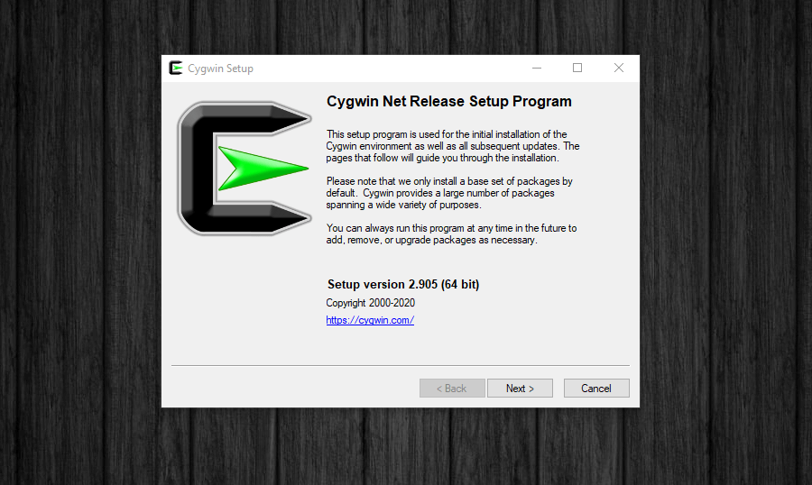
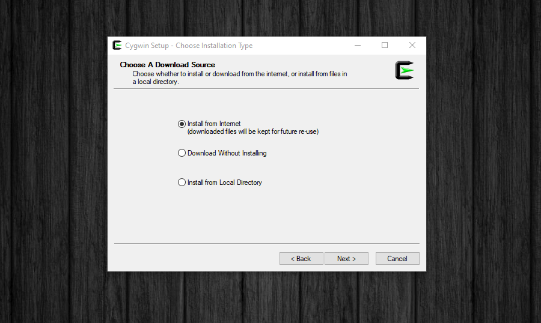
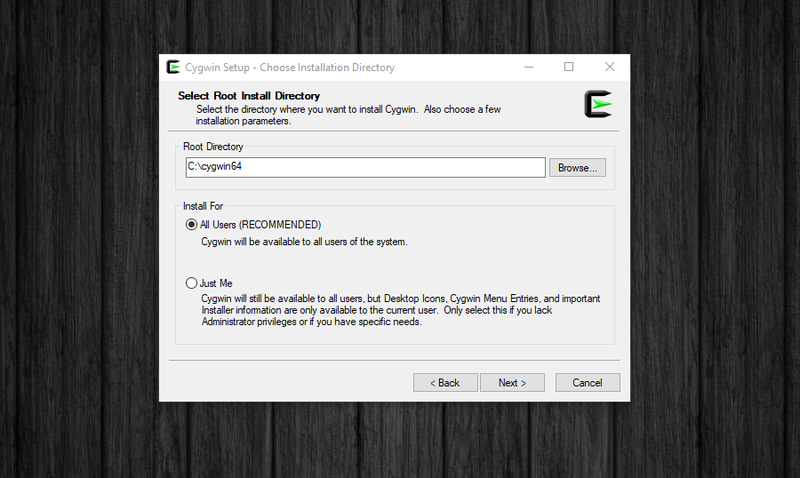
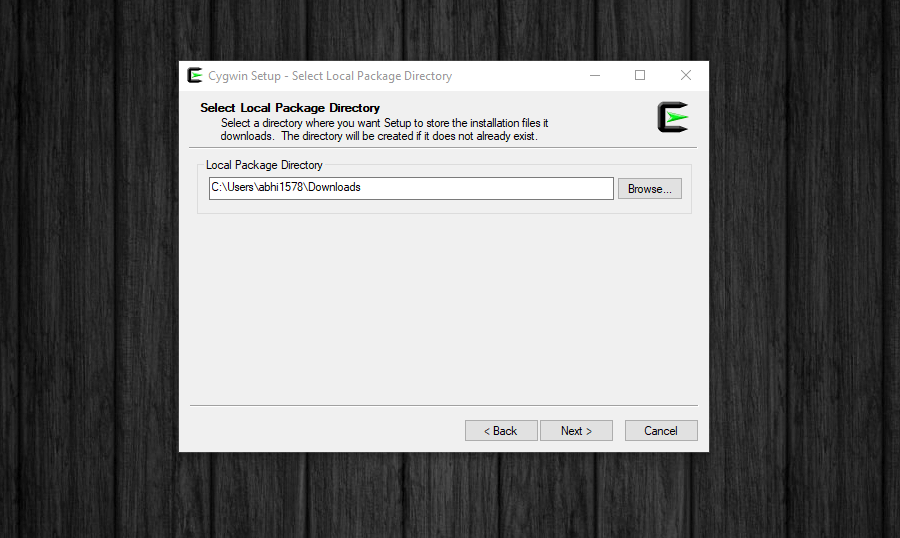
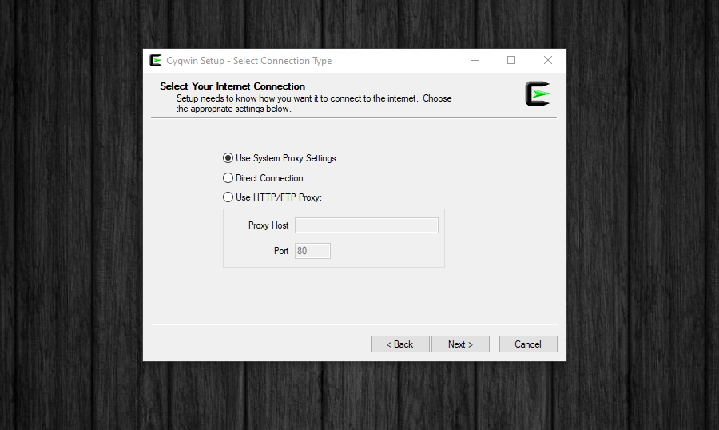
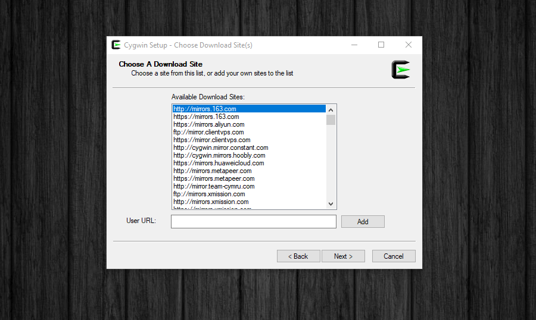
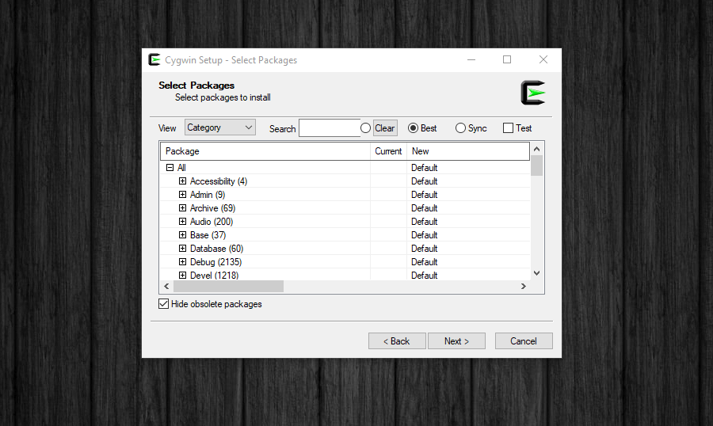
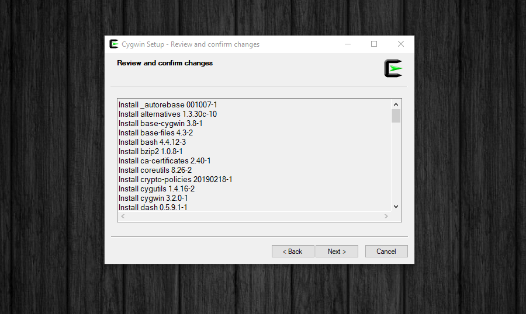
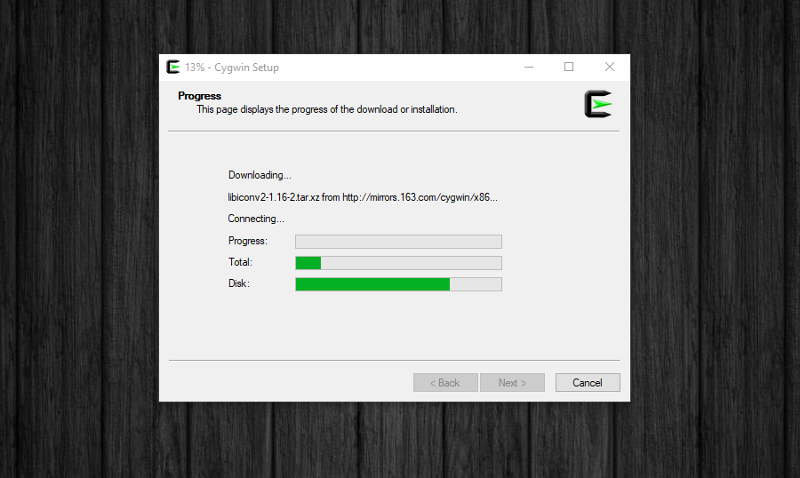
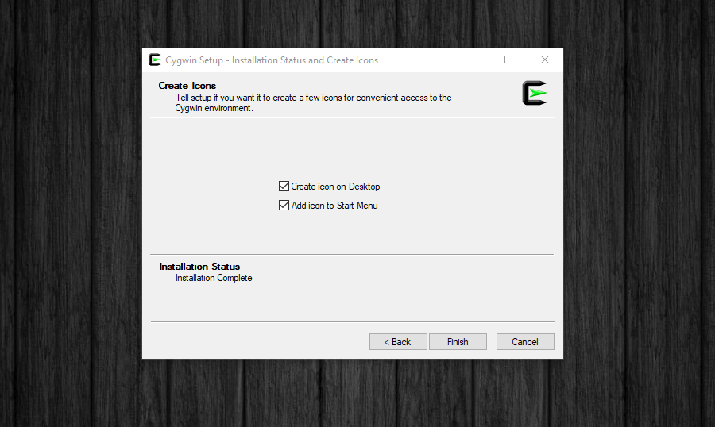

## Среда разработки
**Visual Studio Code** (VS Code) — текстовый редактор, разработанный Microsoft для Windows, Linux и macOS. 

Позиционируется как «лёгкий» редактор кода для кроссплатформенной разработки веб- и облачных приложений. Включает в себя отладчик, инструменты для работы с Git, подсветку синтаксиса, IntelliSense и средства для рефакторинга. Имеет широкие возможности для кастомизации: пользовательские темы, сочетания клавиш и файлы конфигурации. Распространяется бесплатно, разрабатывается как программное обеспечение с открытым исходным кодом, но готовые сборки распространяются под проприетарной лицензией.

### Настройка VS Code для работы с Cygwin
В зависимости от версии редактора Вам необходимо открыть пользовательские настройки в режиме JSON.

VS Code 1.55 (March 2021), необходимо выполнить следующие команды:
1. File :arrow_right: Preferences :arrow_right: Settings
1. Open Settings (JSON) icon 
1. Вставить код ниже

```json
 "terminal.integrated.profiles.windows": {
    "Cygwin": {
        "path": "C:\\cygwin\\bin\\bash.exe",
        "args": ["--login"],
        "env": {"CHERE_INVOKING": "1"}
    }
 }
 ```

 > [!WARNING]
 > Если Вы установили Cygwin не по стандартному пути, то необходимо поменять путь до файла

 > [!WARNING]
 > Если Вы установили Cygwin64, то Вам необходимо поменять путь на  ```"path": "C:\\cygwin64\\bin\\bash.exe"```

В более новых версиях VS Code, необходимо выполнить следующие действия
1. F1 :arrow_right: Open User Setting(JSON)
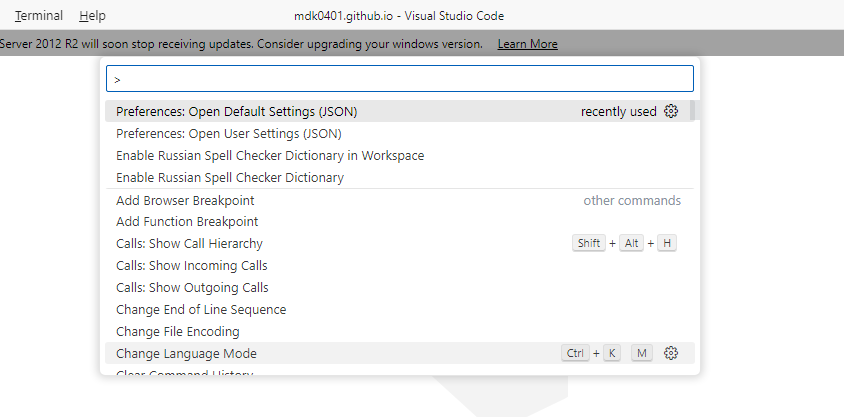
1. Вставить код ниже

```json
 "terminal.integrated.profiles.windows": {
    "Cygwin": {
        "path": "C:\\cygwin\\bin\\bash.exe",
        "args": ["--login"],
        "env": {"CHERE_INVOKING": "1"}
    }
 }
 ```

 > [!NOTE]
 > Можно так же добавить ```"terminal.integrated.defaultProfile.windows": "Cygwin"``` тогда Cygwin будет использовать по умолчанию при открытии окна терминала

 Пример моего файла настроек
 ```json
 {
    "workbench.colorTheme": "Default Light Modern",
    "editor.fontSize": 18,
    "git.enableSmartCommit": true,
    "update.enableWindowsBackgroundUpdates": false,
    "git.confirmSync": false,
    // Добавлено для работы с Bash
    "terminal.integrated.profiles.windows": {
        "Cygwin": {
          "path": "C:\\cygwin64\\bin\\bash.exe",
          "args": ["--login"],
          "env": {"CHERE_INVOKING": "1"},
          "icon": "terminal-bash"
        }
      },
    "terminal.integrated.defaultProfile.windows": "Cygwin",
    "telemetry.telemetryLevel": "off",
    "cSpell.language": "en,ru",
    "liveServer.settings.donotShowInfoMsg": true
}
 ```

## Команды GNU\Linux
### ls
(List). С помощью этой утилиты можно посмотреть, что содержится в папке. Без указания конкретного пути показывает текущий каталог. Если путь указан, то переход совершиться в конечный его каталог.

### cat
(Concatenate / Catenate). Команда двойного назначения. Показывает на экране что содержит файл или стандартный ввод. Также к «склеивает» несколько переданных подряд файлов в один. 

### cd
(Change Directory). Меняет текущий каталог, в котором работает терминал на указанный. Когда терминал запущен, он использует по умолчанию корневой каталог, вернуться в который можно, набрав:
```
cd ~

cd .
cd ..
cd -
```

### &&
Двойной амперсанд – не полноценная команда, а управляющий оператор. Он предназначен для выполнения последовательного ряда команд.

### mkdir
(Make Directory). Создаёт новую директорию. Можно также создать полную структуру подкаталогов, если ввести сочетание:
```
mkdir -p /path/to/folder
```

### cp
(Copy). Утилита, позволяющая скопировать файл или каталог. Копирование файлов и каталогов. Чтобы копирование прошло рекурсивно, т. е. включало все поддиректории и файлы в них, надо добавить к команде:
```
cp -r
```

### mv
(Move). Эта команда в Linux одновременно отвечает за перемещение и переименование файла или каталога. При переименовании файл перемещается в ту же папку, но уже названную по-новому.

### rm
(Remove). Отвечает за удаление папок и файлов. Использовать оператор rm следует крайне осторожно. В Linux файлы удаляются не в корзину, откуда их можно восстановить, а стираются безвозвратно. Для рекурсивного удаления используйте сочетание:
```
rm -r
```

### find
Осуществляет поиск в файловой системе, файлах и папках. Для результатов поиска можно выполнять дополнительные команды.

### pwd
Отображает на экране текущий каталог.

### clear
Команда полной очистки окна терминала удаляет все ранее выведенные сообщения.

### history
Показывает ранее введённые пользователем команды. Перемещаться по списку введённых команд можно, нажимая на клавиатуре «Вверх» и «Вниз».

### ;
Точка с запятой — ещё один оператор для последовательного запуска нескольких команд в одной строке.

### kill 
Прекращает операцию, находя ее через идентификатор процесса (PID).

### ps
(Process Status). Команда находит по заданным параметрам и выводят информацию об активных процессах. Самый доступный способ найти идентификатор процесса (PID).

### more / less
Две команды для облегчения просмотра больших текстов, не умещающихся на одном экране эмулятора терминала. Т.к. функционально команды одинаковы, но less — новее и поддерживает больше опций, рекомендуется использовать именно её.

### head / tail
Пара дополняющих друг друга команд для просмотра на одном экране начала и конца текста. Команда head выдаёт 10 (по умолчанию) первых строк текста, tail — последних. Число строк в обоих случаях меняется с помощью аргумента -n. 

### grep
(Global Regular Expression and Print). Ищет текст по заданному шаблону. Это очень полезно, когда надо проанализировать работу команды, которая сопровождается большим объёмом текстовой информации. Шаблон может заполняться строкой или регулярным выражением. 

### wc
(Word Count). Программа для подсчета заданных параметров в тексте. Считает такие показатели, как символы, слова, строки и байты.

### su / sudo
(Switch User / Substitute User & Do). Две команды для запуска процессов от имени другого пользователя без завершения текущего сеанса. При использовании su по умолчанию происходит переход на пользователя root. Команда sudo способна не только активировать режим суперпользователя (о чём упоминалось выше), но и выполнить команду от имени другого пользователя без реального переключения на него. Поэтому второй вариант считается более безопасным.

### date
Команда Linux, сообщающая информацию о времени. Отдельными переменными можно задать удобный формат вывода и число отображаемых параметров, вплоть до миллисекунд.

### uname
Утилита, выводящая информацию об операционной системе. Без дополнительных параметров она выдаст только название ядра. Чтобы получить всю возможную системную информацию, введите:
```
uname -a
```

### df
(Disk Free). Даёт полную информацию о свободном пространстве на диске. Анализ включает перечисление файловых систем смонтированных разделов, обзор занятого и свободного места на диске. Для более удобного вывода информации, лучше применять сочетание:
```
df –h
```

### du
(Disk Usage). Позволяет определить размер файла или каталога. 

### sleep
Задаёт время бездействия системы.

### yes
Утилита автозаполнения поля согласия в команде или скрипте. Введите: yes название_команды и вам не придётся делать подтверждение вручную, когда этого потребует сценарий взаимодействия программы с пользователем.

### chmod
(Change Mode). Изменяет разрешения доступа к файлу. Под доступом имеется в виду классическая триада: чтение r, изменение w и запуск x.
При этом, «разрешения» могут быть указаны буквенным, символьным (rwx) или цифровым кодом. Кроме того, эта переменная может включать информацию о владельце (u / g / o / a) и операции с правами (+ / — / =).

### >, <
Перенаправление ввода / вывода позволяет заменить один из этих файлов на свой. Например, вы можете заставить программу читать данные из файла в файловой системе, а не клавиатуры, также можете выводить ошибки в файл, а не на экран и т д. Все это делается с помощью символов "<" и ">".
```
top -bn 5 > top.log
```

> [!WARNING]
> Символ "\>" перезаписывает информацию из файла, если там уже что-то есть. Для добавления данных в конец используйте "\>\>".

### |
Можно работать не только с файлами, но и перенаправлять вывод одной команды в качестве ввода другой. Это очень полезно для выполнения сложных операций. Например, выведем пять недавно измененных файлов:
```
 ls -lt | head -n 5
```


 ## Установка недостающих компонентов в Cygwin
 Для установки дополнительных компонентов можно воспользоваться установочным файлом и через поиск найти доступные компоненты для установки.
 

 > [!NOTE]
 > Попробуйте установить ```nano``` и ```mc```