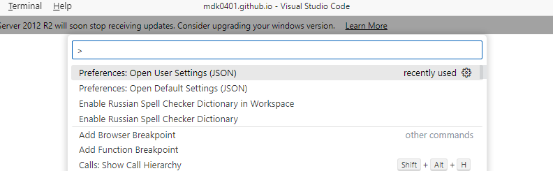

# Урок 02. Основные команды GNU\Linux. Cygwin. Настройка среды разработки
[На главную](/mdk0401.github.io)

## Что такое Cygwin
**Cygwin** (произносится /ˈsɪgwɪn/) представляет собой Unix-подобную среду и интерфейс командной строки для Microsoft Windows. Цель Cygwin выражена в ее девизе: _"Ощутите это ощущение Linux – на Windows"_("Get that Linux feeling – on Windows").

Расположение каталогов установки Cygwin имитирует корневую файловую систему Unix-подобных систем с такими каталогами, как /bin, /home, /etc, /usr и /var.

Cygwin представляет собой инструмент для портирования ПО UNIX в Windows и представляет собой библиотеку. Кроме того, Cygwin включает в себя инструменты разработки GNU для выполнения основных задач программирования, а также и некоторые прикладные программы, эквивалентные базовым программам UNIX. 

> [!NOTE]
> Нам интересен Cygwin прежде всего как эмулятор командной строки, с возможностью написания скриптов для **Bash**

Аналоги Cygwin:
+ MinGW (MSYS)
+ GnuWin32
+ Badun

## Установка Cygwin
[Официальный сайт Cygwin](https://cygwin.com/)
> [!IMPORTANT]
> Кому лень искать ссылку на установочный файл [download setup](https://cygwin.com/setup-x86_64.exe)


## Среда разработки
**Visual Studio Code** (VS Code) — текстовый редактор, разработанный Microsoft для Windows, Linux и macOS. 

Позиционируется как «лёгкий» редактор кода для кроссплатформенной разработки веб- и облачных приложений. Включает в себя отладчик, инструменты для работы с Git, подсветку синтаксиса, IntelliSense и средства для рефакторинга. Имеет широкие возможности для кастомизации: пользовательские темы, сочетания клавиш и файлы конфигурации. Распространяется бесплатно, разрабатывается как программное обеспечение с открытым исходным кодом, но готовые сборки распространяются под проприетарной лицензией.

### Настройка VS Code для работы с Cygwin
В зависимости от версии редактора Вам необходимо открыть пользовательские настройки в режиме JSON.

VS Code 1.55 (March 2021), необходимо выполнить следующие команды:
1. File :arrow_right: Preferences :arrow_right: Settings
1. Open Settings (JSON) icon 
1. Вставить код ниже

```json
 "terminal.integrated.profiles.windows": {
    "Cygwin": {
        "path": "C:\\cygwin\\bin\\bash.exe",
        "args": ["--login"],
        "env": {"CHERE_INVOKING": "1"}
    }
 }
 ```

 > [!WARNING]
 > Если Вы установили Cygwin не по стандартному пути, то необходимо поменять путь до файла

 > [!WARNING]
 > Если Вы установили Cygwin64, то Вам необходимо поменять путь на  ```"path": "C:\\cygwin64\\bin\\bash.exe"```

В более новых версиях VS Code, необходимо выполнить следующие действия
1. F1 :arrow_right: Open User Setting(JSON)

1. Вставить код ниже

```json
 "terminal.integrated.profiles.windows": {
    "Cygwin": {
        "path": "C:\\cygwin\\bin\\bash.exe",
        "args": ["--login"],
        "env": {"CHERE_INVOKING": "1"}
    }
 }
 ```

 > [!NOTE]
 > Можно так же добавить ```"terminal.integrated.defaultProfile.windows": "Cygwin"``` тогда Cygwin будет использовать по умолчанию при открытии окна терминала

 Пример моего файла настроек
 ```json
 {
    "workbench.colorTheme": "Default Light Modern",
    "editor.fontSize": 18,
    "git.enableSmartCommit": true,
    "update.enableWindowsBackgroundUpdates": false,
    "git.confirmSync": false,
    // Добавлено для работы с Bash
    "terminal.integrated.profiles.windows": {
        "Cygwin": {
          "path": "C:\\cygwin64\\bin\\bash.exe",
          "args": ["--login"],
          "env": {"CHERE_INVOKING": "1"},
          "icon": "terminal-bash"
        }
      },
    "terminal.integrated.defaultProfile.windows": "Cygwin",
    "telemetry.telemetryLevel": "off",
    "cSpell.language": "en,ru",
    "liveServer.settings.donotShowInfoMsg": true
}
 ```