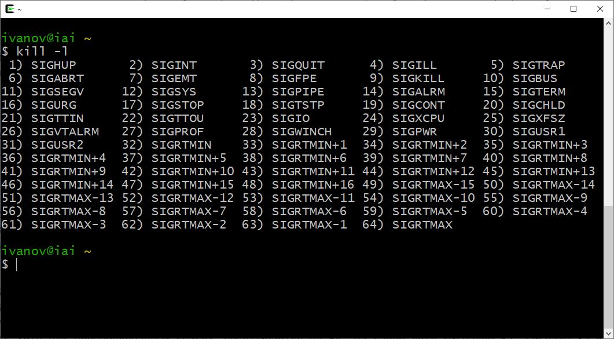
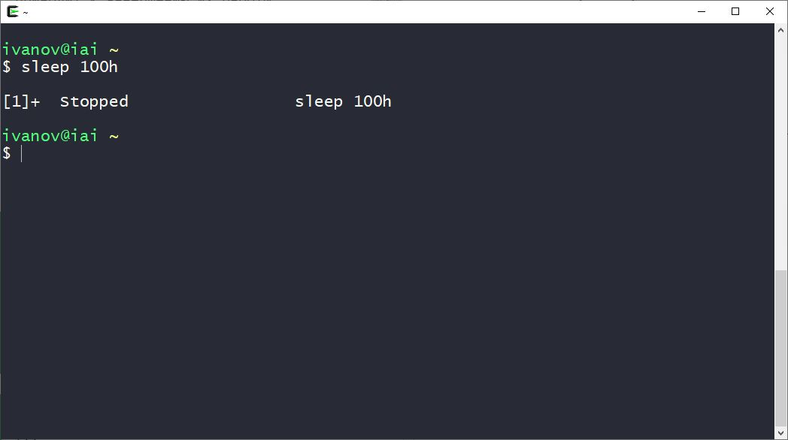
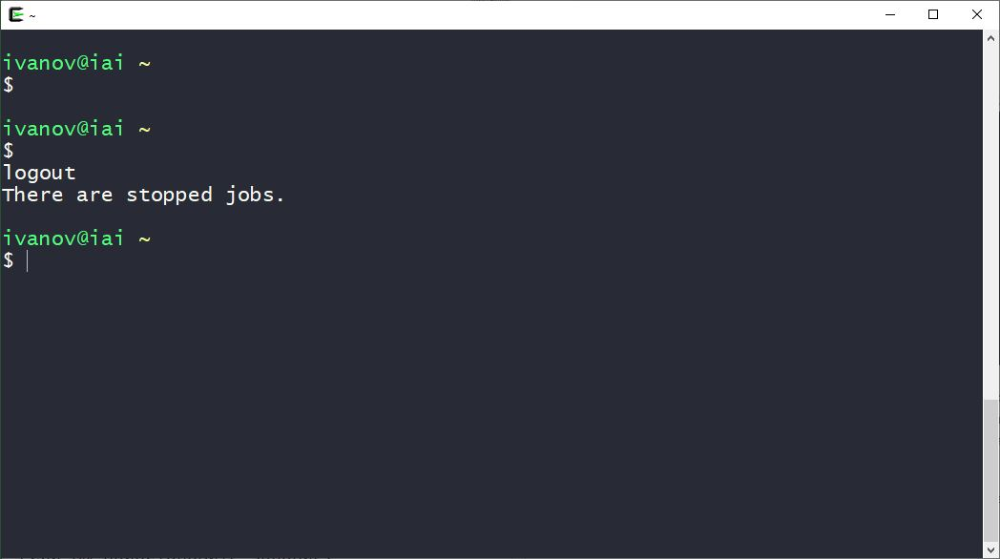
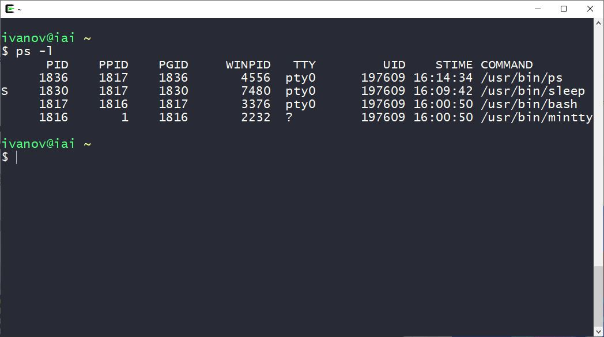
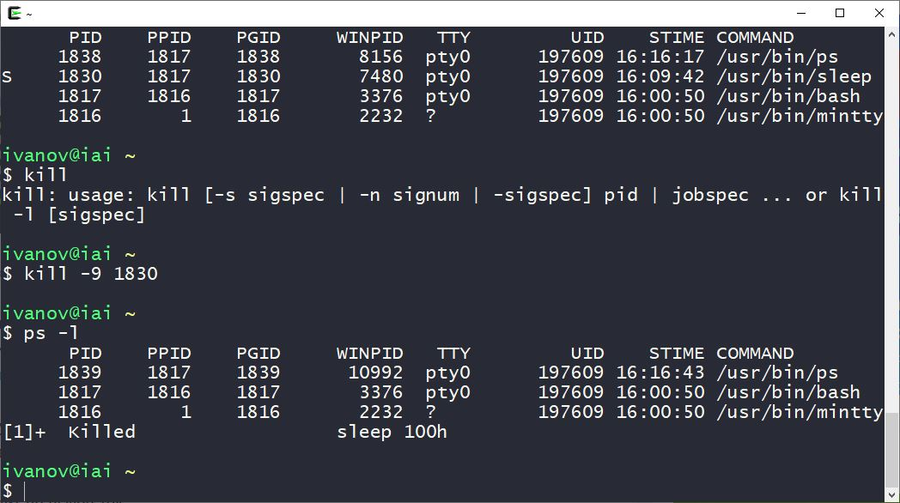
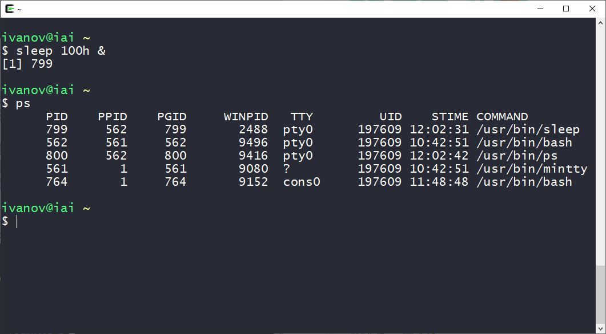
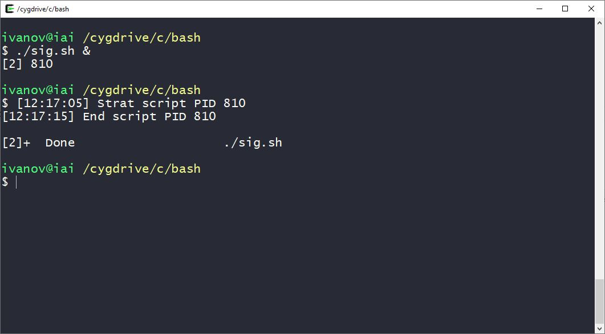
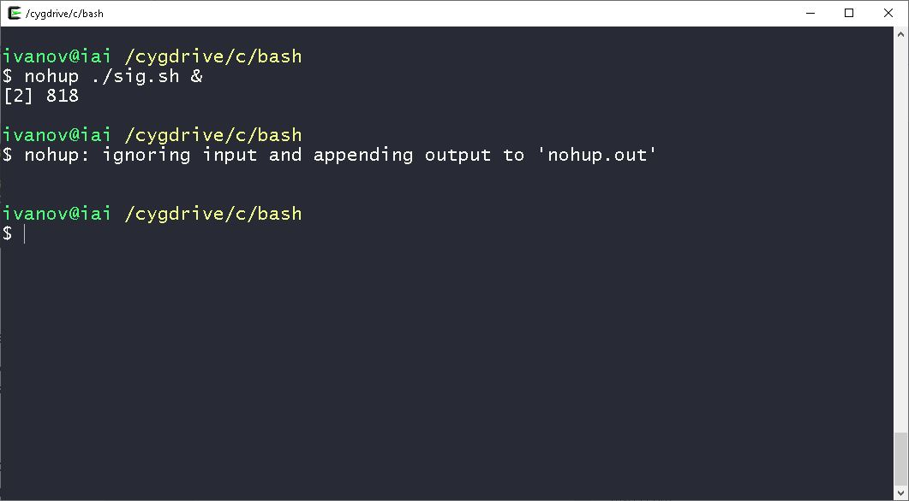
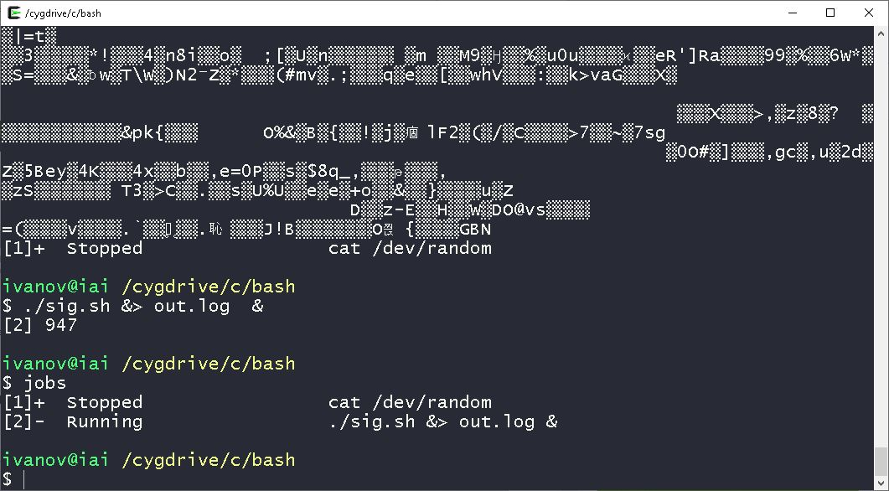

# Урок 10. Сигналы Linux

[На главную](/mdk0401.github.io)

## Введение
На данном этапе освоения bash у вас вполне могут возникнуть вопросы о том, как управлять работающими скриптами, как автоматизировать их запуск.

До сих пор мы вводили имена скриптов в командную строку и нажимали Enter, что приводило к немедленному запуску программ, но это — не единственный способ вызова сценариев. Этот урок о том как скрипт может работать с сигналами Linux, о различных подходах к запуску скриптов и управлению ими во время работы.


## Сигналы 
**Сигналы** — это числовые сообщения, которые посылаются запущенным приложениям операционной системой, другими приложениями или пользователем. Сигналы, как правило, ожидают от приложения какой-то определённой реакции, например «корректно завершить работу», «приостановить работу» или «умри!». 

> [!NOTE]
> Ядро Linux посылает процессам сигналы о событиях, на которые им нужно реагировать. Скрипты должны надежно обрабатывать сигналы, "очищать" и производить освобождение ресурсов , даже если вы нажмете ```Ctrl+C```. 

**Сигналы** — это короткие, быстрые односторонние сообщения, отправляемые процессам, сценариями, программами и демонами. **Они сообщают процессу о том, что произошло.** Возможно, пользователь нажал ```Ctrl+C```, или приложение могло попытаться записать в память, к которой у него нет доступа.

Если автор процесса ожидал, что ему может быть отправлен определенный сигнал, он может написать в программе или сценарии подпрограмму(функцию) для обработки этого сигнала. Такая процедура называется **обработчиком сигнала**. Он ловит или перехватывает сигнал и выполняет какое-то действие в ответ на него.

Linux использует множество сигналов, но с точки зрения сценариев существует лишь небольшое подмножество сигналов, которые могут вас заинтересовать. В частности, в нетривиальных сценариях сигналы, сообщающие сценарий для завершения работы должен быть перехвачен (где это возможно) и выполнено корректное завершение работы.

> [!NOTE]
> Сценариям, которые создают временные файлы или открывают порты брандмауэра, можно дать возможность удалить временные файлы или закрыть порты до их закрытия. Если сценарий просто умирает в момент получения сигнала, ваш компьютер может остаться в непредсказуемом состоянии.

## Список сигналов
В Linux используется 64 сигнала. Список можно посмотреть в терминале командой ```kill```

```bash
kill -l
```



Хотя наш пронумерованный список заканчивается на 64, на самом деле сигналов 62. Сигналы 32 и 33 отсутствуют. Они не реализованы в Linux. Они были заменены функциями компилятора ```gcc``` для обработки потоков в реальном времени. Все, от сигнала 34, ```SIGRTMIN```, до сигнала 64, ```SIGRTMAX```, являются сигналами реального времени.

Вот список наиболее часто используемых, которые наверняка пригодятся при разработке сценариев командной строки

 + Сигнал ```SIGHUP``` (номер 1) изначально был предназначен для того, чтобы информировать программу о потере связи с управляющим терминалом. Этот сигнал посылается процессам и в случае закрытия виртуальных терминалов, которые используются на современных системах вместо аппаратных терминалов. Обычным действием по умолчанию для ```SIGHUP``` является перечитывание конфигурации без остановки(Закрытие терминала).

+ Сигнал ```SIGINT``` (номер 2) посылается процессу, если пользователь терминала дал команду прервать процесс (обычно это сочетание клавиш ```Ctrl+C```).

+ Сигнал ```SIGQUIT``` (номер 3) посылается процессу, если пользователь терминала дал команду остановить процесс комбинацией «quit» (обычно это сочетание клавиш ```Ctrl+\```). Этот сигнал также указывает, что система должна выполнить дамп памяти для процесса.

+ Сигнал ```SIGKILL``` (номер 9) завершает работу программы. Программа не может ни обработать, ни игнорировать этот сигнал.

+ Сигнал ```SIGPIPE``` (номер 13) посылается процессу при записи в соединение (pipe, socket) при отсутствии или обрыве соединения с другой (читающей) стороной.

+ Сигнал ```SIGTERM``` (номер 15) вызывает «вежливое» завершение программы. Получив этот сигнал, программа может выполнить необходимые перед завершением операции (например, высвободить занятые ресурсы). Получение ```SIGTERM``` свидетельствует не об ошибке в программе, а о желании ОС или пользователя завершить ее.

+ Сигнал ```SIGCONT``` (номер 18) возобновляет выполнение процесса, остановленного сигналом ```SIGSTOP``` или сигналом ```SIGTSTP```.

+ Сигнал ```SIGSTOP``` (номер 19) приостанавливает выполнение процесса. Как и ```SIGKILL```, этот сигнал невозможно перехватить или игнорировать.

+ Сигнал ```SIGTSTP``` (номер 20) приостанавливает процесс по команде пользователя (обычно это сочетание клавиш ```Ctrl+Z```). Для возобновления выполнения используется сигнал ```SIGCONT```.

> [!IMPORTANT]
> На сигналы можно ссылаться по имени, номеру или сокращенному имени. Их сокращенное имя — это просто их имя с удаленным начальным *SIG*.

Если оболочка bash получает сигнал ```SIGHUP``` когда вы закрываете терминал, она завершает работу. Перед выходом она отправляет сигнал ```SIGHUP``` всем запущенным в ней процессам, включая выполняющиеся скрипты.

Сигнал ```SIGINT``` приводит к временной остановке работы. Ядро Linux перестаёт выделять оболочке процессорное время. Когда это происходит, оболочка уведомляет процессы, отправляя им сигнал ```SIGINT```.

**Bash-скрипты не контролируют эти сигналы, но они могут распознавать их и выполнять некие команды для подготовки скрипта к последствиям, вызываемым сигналами.**

## Посылка сигналов 
Сигналы посылаются:

+ из терминала, нажатием специальных клавиш или комбинаций (например, нажатие ```Ctrl-C``` генерирует ```SIGINT```, ```Ctrl-\``` - ```SIGQUIT```, а ```Ctrl-Z``` - ```SIGTSTP```);

+ ядром системы:
    - при возникновении аппаратных исключений (недопустимых инструкций, нарушениях при обращении в память, системных сбоях и т. п.);
    - ошибочных системных вызовах;
    - для информирования о событиях ввода-вывода;
    
+ одним процессом другому (или самому себе), с помощью системного вызова ```kill()```, в том числе: из shell, утилитой ```/bin/kill```.

**Сигналы не могут быть посланы завершившемуся процессу, находящемуся в состоянии «зомби».**

## Отправка сигналов скриптам
Оболочка bash позволяет отправлять скриптам сигналы, пользуясь комбинациями клавиш на клавиатуре, хотя обычно для отправки сигналов приложениям используется программа ```kill```.

> [!NOTE]
> Например ```Ctrl+C``` или ```Ctrl+Z```. 

Это оказывается очень кстати если нужно **временно остановить выполняющийся скрипт или завершить его работу**.

### Завершение работы процесса
Комбинация клавиш ```Ctrl+C``` генерирует сигнал ```SIGINT``` и отправляет его всем процессам, выполняющимся в оболочке, что приводит к завершению их работы.

Выполним в оболочке такую команду

```bash
sleep 0.00005d
```

После этого завершим её работу 
комбинацией клавиш ```Ctrl+C```.

### Временная остановка процесса
Комбинация клавиш ```Ctrl+Z``` позволяет сгенерировать сигнал ```SIGTSTP```, который приостанавливает работу процесса, но не завершает его выполнение. Такой процесс остаётся в памяти, его работу можно возобновить. Выполним в оболочке команду:

```bash
sleep 100h
```

И временно остановим её комбинацией клавиш ```Ctrl+Z```.



Число в квадратных скобках — это номер задания, который оболочка назначает процессу. Оболочка рассматривает процессы, выполняющиеся в ней, как задания с уникальными номерами. Первому процессу назначается номер 1, второму — 2, и так далее.

Если вы приостановите задание, привязанное к оболочке, и попытаетесь выйти из неё, bash выдаст предупреждение.



Просмотреть приостановленные задания можно такой командой

```bash
ps –l
```



Если нужно завершить работу приостановленного процесса, можно воспользоваться командой ```kill```.

```bash
kill -9 1830
```

> [!NOTE]
> 1830 - номер процесса. -9 - номер сигнала(```SIGKILL```) который надо послать процессу



## Перехват сигналов
Могут быть ситуации, когда нежелательно, чтобы пользователи прерывали работу сценария, например с помощью ```Ctrl+C```. Поскольку нужно освободить входной поток или удалить временные файлы.

Для того, чтобы включить в скрипте отслеживание сигналов Linux, используется команда ```trap```. 

```bash
trap действие сигнал
```
Команда ```trap``` работает довольно просто — при возникновении сигнала будет выполнено указанное действие. Если действие простое (цепочка команд, умещающаяся на одной строке), его можно указать прямо в аргументе ```trap```. Иначе надо объявить функцию и поместить вызов этой функции в ```trap```.

> [!WARNING]
> Можно обрабатывать стандартные сигналы, а также доступны специфические для Bash: ```DEBUG```, ```RETURN```, ```ERR```, ```EXIT```.

Если скрипт получает сигнал, указанный при вызове этой команды, он обрабатывает его самостоятельно, при этом оболочка такой сигнал обрабатывать не будет.

Команда ```trap``` позволяет скрипту реагировать на сигналы, в противном случае их обработка выполняется оболочкой без его участия.

Рассмотрим пример, в котором показано, как при вызове команды trap задаётся код, который надо выполнить, и список сигналов, разделённых пробелами, которые мы хотим перехватить. В данном случае это всего один сигнал

```bash
trap 'echo "SIGINT"' SIGINT

echo "Start sleep 100m"

sleep 100m
exit 0
```

```bash
trap "echo 'send SIGINT'" SIGINT

count=0

while [ $count -ne 10 ]
do
    echo "count = $count"
    sleep 3

    ((count++))
done
```

Команда ```trap```выводит текстовое сообщение всякий раз, когда она обнаруживает сигнал ```SIGINT```, который можно сгенерировать, нажав ```Ctrl+C``` на клавиатуре.

Каждый раз, когда вы нажимаете клавиши ```CTRL+C```, скрипт выполняет команду ```echo```, указанную при вызове ```trap``` вместо того, чтобы позволить оболочке завершит его работу.

Для игнорирования сигналов команде ```trap``` надо передать пустую строку в качестве первого аргумента. Скрипт ниже можно прервать только смертоносным сигналом ```SIGKILL```

```bash
trap '' SIGHUP SIGINT SIGQUIT SIGTERM
sleep 600

# open new tab and input kill -9 
```

> [!IMPORTANT]
> Обработчик по умолчанию для большинства сигналов завершает выполнение процесса. Для альтернативной обработки всех сигналов, за исключением ```SIGKILL``` и ```SIGSTOP```, процесс может назначить свой обработчик или игнорировать их возникновение. Единственное исключение — процесс с *pid 1* (```init```), который имеет право игнорировать или обрабатывать любые сигналы, включая ```KILL``` и ```STOP```. 

## Перехват сигнала выхода из скрипта
Перехватить сигнал выхода из скрипта можно, использовав при вызове команды trap имя сигнала EXIT

> [!IMPORTANT]
> Этот сигнал специфичный для Bash, а не для Linux

```bash
trap 'echo "$(date +%T) End of script. Good bay))"' EXIT

i=0

while [ $i -le 100000 ]
do
    i=$(($i + 1))
done
```

При выходе из скрипта, будь то нормальное завершение его работы или завершение, вызванное сигналом ```SIGINT```(```CTRL+C```), сработает перехват и оболочка исполнит команду.

## Модификация перехваченных сигналов и отмена перехвата
Для модификации перехваченных скриптом сигналов можно выполнить команду trap с новыми параметрами

```bash
trap 'echo ; pwd ; date +%T' SIGINT

cat /dev/random

# new param
trap 'echo "[$(date +%T)] SIGINT"' SIGINT

count=10

while [ $count -gt 0 ]
do
    echo "count = $count"
    sleep 0.05m

    ((count--))
done
```

После модификации сигналы будут обрабатываться по-новому.

Если действие по умолчанию для сигнала было изменено с помощью ```trap```, его можно восстановить с помощью все той же команды ```trap``` — надо опустить первый аргумент или заменить его дефисом 

```bash
trap сигнал
trap - сигнал
```

```bash
trap 'trap - SIGINT; echo "Handler SIGINT canceled"' SIGINT
# trap - SIGINT

while [ 1 ]
do
    echo "[$(date +%T)] ProcessID $$"
    sleep 1
done
```

Первое нажатие ```CTRL+C``` приходится на момент когда перехват сигнала был в силе. Перехват сигнала выполняет команду ```trap - SIGINT``` для восстановление действия по умолчанию. 

После второго нажатия комбинации ```CTRL+C``` сигнал сработает обычным образом, завершив работу скрипта.

## Выполнение сценариев командной строки в фоновом режиме
Иногда bash-скриптам требуется немало времени для выполнения некоей задачи. При этом вам может понадобиться возможность нормально работать в командной строке, не дожидаясь завершения скрипта. Реализовать это не так уж и сложно.

Если вы видели список процессов, выводимый командой ps, вы могли заметить процессы, которые выполняются в фоне и не привязаны к терминалу.

Запустим скрипт, указав после имени символ амперсанда ```&```

```bash
./myscipt &
```

Это приведёт к тому, что он будет запущен как фоновый процесс.



Скрипт будет запущен в фоновом процессе, в терминал выведется его идентификатор, а когда его выполнение завершится, вы увидите сообщение об этом.

```bash
echo "[$(date +%T)] Strat script PID $$"

i=0

while [ $i -le 1000000 ]
do
    i=$(($i + 1))
done

echo "[$(date +%T)] End script PID $$"
```



Обратите внимание на то, что хотя скрипт выполняется в фоне, он продолжает использовать терминал для вывода сообщений в ```STDOUT``` и ```STDERR```, то есть, выводимый им текст или сообщения об ошибках можно будет увидеть в терминале.

> [!IMPORTANT]
> При таком подходе, если выйти из терминала, скрипт, выполняющийся в фоне, так же завершит работу.

## Выполнение скриптов, не завершающих работу при закрытии терминала
Скрипты можно выполнять в фоновых процессах даже после выхода из терминальной сессии. Для этого можно воспользоваться командой ```nohup```.

```bash
nohup ./sctipt &
```

Эта команда позволяет запустить программу, блокируя сигналы ```SIGHUP```, отправляемые процессу. В результате процесс будет исполняться даже при выходе из терминала, в котором он был запущен.



Команда ```nohup``` отвязывает процесс от терминала. Это означает, что процесс потеряет ссылки на ```STDOUT``` и ```STDERR```. Для того, чтобы не потерять данные, выводимые скриптом, ```nohup``` автоматически перенаправляет сообщения, поступающие в ```STDOUT``` и в ```STDERR```, в файл ```nohup.out```.

Обратите внимание на то, что при запуске нескольких скриптов из одной и той же директории то, что они выводят, попадёт в один файл ```nohup.out```.

## Просмотр заданий
Команда jobs позволяет просматривать текущие задания, которые выполняются в оболочке. 

```bash
cat /dev/random
# sleep 100m
# либо скрипт, выполнение которого можно приостановить
```

И временно остановим комбинацией клавиш ```CTRL+Z```

Запустим другой скрипт в фоновом режиме, при этом перенаправим вывод скрипта в файл так, чтобы он ничего не выводил на экране

```bash
while true
do
    echo "$(date +%T) PID $$"
    sleep 1
done
```

```bash
./script &> out.log &
```



Выполнив теперь команду ```jobs```, мы увидим сведения как о приостановленном скрипте, так и о том, который работает в фоне.

Ключ ```-l``` при вызове команды ``jobs`` указывает на то, что нам нужны сведения об ID процессов.

## Перезапуск приостановленных заданий
Для того, чтобы перезапустить скрипт в фоновом режиме, можно воспользоваться командой ```bg```

```bash
bg n
```

**bg** — команда управления заданиями в Unix и Unix-подобных операционных системах, возобновляющая выполнение приостановленного процесса в фоновом режиме, возобновляющийся процесс продолжает выполняться в фоне без ввода пользователем каких-либо команд с терминала.

Для перезапуска задания в обычном режиме воспользуйтесь командой ```fg```. Чтобы «разбудить» процесс, следует передать команде в качестве параметра номер задачи

```bash
fg n
```

**fg** — команда возобновления работы задачи. Она позволяет возобновить работу приостановленного процесса или вывести его из фонового режима. 

