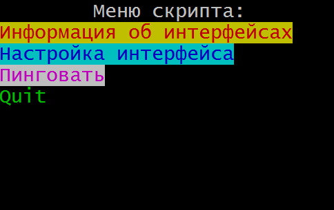

# ПР02 Работа с массивами в Bash

[На главную](/mdk0401.github.io)

Каждую задачу необходимо разделять при выводе в терминал.

```bash
echo "************ Задание 1 *********************"
...
...
echo "************ Задание 2 *********************"
...
...
```

## Задание 1. Меню скрипта
Ваша задача создать меню скрипта как на рисунке ниже.



> [!WARNING]
> Выбор фонового цвета и цвета текста остается за Вами.

Само меню должно храниться в массиве.

Все цвета хранить в отдельных переменных.


