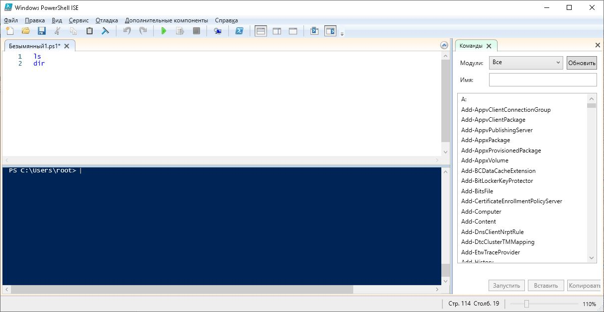

# Урок 15. PowerShell. Основные понятия

[На главную](/mdk0401.github.io)

**PowerShell** – это язык сценариев и командная оболочка Windows, которые разработаны для администрирования и конфигурирования операционных систем Windows.

*Для чего, собственно, компании Microsoft потребовалось создавать этот совершенно новый инструмент и язык программирования?*

*Какую пользу он может принести обычным пользователям и системным администраторам?*

*Почему недостаточно было существующих средств?*

## Предшественники PowerShell
В настоящее время графический интерфейс Windows стал настолько привычным, что многие пользователи и начинающие администраторы даже не задумываются об альтернативных способах управления операционной системой с помощью командной строки (*command line*) и различных сценариев (*scripts*). Зачастую они просто не знают о тех преимуществах, которые дают эти инструменты с точки зрения автоматизации работы.

Компания Microsoft изначально ориентировалась на широкую аудиторию неискушенных пользователей, не желающих особо вникать в технические детали выполнения тех или иных действий в системе. Поэтому основные усилия разработчиков операционной системы направлялись на улучшение графической оболочки для более комфортной работы непрофессионалов, а не на создание рабочей среды для специалистов или опытных пользователей.

Однако подобная модель управления не является масштабируемой: если с помощью стандартных графических инструментов администрировать не один, а десять серверов, то последовательность изменений настроек в диалоговых окнах придется повторить десять раз. Следовательно, в этом случае остро встает вопрос об автоматизации выполнения рутинных операций (например, проведения инвентаризации оборудования и программного обеспечения, мониторинга работы служб, анализа журналов событий и т.д.) на множестве компьютеров.

В UNIX-системах в качестве инструмента автоматизации выступает стандартная оболочка (*sh*) или ее модификации (*bash*, *ksh*, *csh* и т. д.). 

В операционной системе Windows дело **обстоит сложнее**. На сегодняшний день одного "идеального" средства автоматизации, удовлетворяющего сразу всем требованиям, в Windows нет. 

В последних версиях операционной системы одновременно поддерживаются несколько стандартных инструментов автоматизации, сильно отличающихся друг от друга: 

+ оболочка командной строки `cmd.exe`
+ среда выполнения сценариев **Windows Script Host (WSH)**
+ оболочка **WMI Command-line (WMIC)**
+ оболочка **Microsoft PowerShell**

## Оболочка командной строки command.com/cmd.exe
Во всех версиях операционной системы Windows поддерживается интерактивная оболочка командной строки (command shell / `command.com`), и по умолчанию устанавливается определенный набор утилит командной строки. 

> [!NOTE]
> Вообще, любую операционную систему можно представить в виде совокупности ядра системы, которое имеет доступ к аппаратуре и управляет файлами и процессами, и оболочки (командного интерпретатора) с утилитами, которые позволяют пользователю получить доступ к функциональности ядра операционной системы. 

Наряду с интерактивным режимом работы, оболочка  поддерживает и пакетный режим, в котором система последовательно выполняет команды, записанные в текстовом файле-сценарии - **Batch скрипт**. 

Начиная с версии Windows NT, оболочка командной строки представляется интерпретатором `cmd.exe`, который расширяет возможности оболочки `command.com` операционной системы MS-DOS. 

В свою очередь функциональность командного интерпретатора `command.com` была позаимствована из операционной системы CP/M, командный интерпретатор которой представлял собой значительно упрощенный и урезанный вариант оболочки UNIX-систем. 

Таким образом, оболочка командной строки MS-DOS изначально уступала UNIX-оболочкам по удобству работы и развитости языка сценариев. 

В командной оболочке Windows NT (cmd.exe), несмотря на все сделанные улучшения, не удалось преодолеть данное отставание ни в режиме интерактивной работы (например, в cmd.exe отсутствует поддержка псевдонимов для длинных названий команд и не реализовано автоматическое завершение команд при вводе их с клавиатуры), ни в синтаксисе или возможностях языка командных файлов. 

Ситуация усугублялась тем, что Windows всегда проигрывала UNIX-системам в количестве и функциональных возможностях стандартных (не требующих дополнительной установки) утилит командной строки, а также в качестве и полноте встроенной справочной системы по командам оболочки. 

Оболочка командной строки `cmd.exe` и командные файлы — наиболее универсальные и простые в изучении средства автоматизации работы в Windows, доступные во всех версиях операционной системы.

При этом оболочка `cmd.exe` и командные файлы существенно проигрывают аналогичным инструментам в UNIX-системах и не обеспечивают доступ к объектным моделям, поддерживаемым операционной системой (COM, WMI, .NET). 

## Сервер сценариев Windows Script Host (WSH)
Следующим шагом в развитии средств и технологий автоматизации в операционной системе Windows стало появление сервера сценариев Windows Script Host (WSH). 

**Windows Script Host** - это инструмент разработанный для всех версий Windows и позволяет непосредственно в операционной системе выполнять сценарии на полноценных языках сценариев (по умолчанию, VBScript и JScript), которые до этого были доступны только внутри HTML-страниц и работали в контексте безопасности веб-браузера (в силу этого подобные сценарии, например, могли не иметь доступа к файловой системе локального компьютера). 

По сравнению с командными файлами интерпретатора cmd.exe сценарии WSH имеют несколько преимуществ. 

Во-первых, VBScript и JScript — это полноценные алгоритмические языки, имеющие встроенные функции и методы для обработки символьных строк, выполнения математических операций, обработки исключительных ситуаций и т. д.; кроме того, для написания сценариев WSH может использоваться любой другой язык сценариев (например, широко распространенный в UNIX системах Perl), для которого установлен соответствующий модуль поддержки. 

Во-вторых, WSH поддерживает несколько собственных объектов, свойства и методы которых позволяют решать некоторые часто возникающие повседневные задачи администратора операционной системы: работа с сетевыми ресурсами, переменными среды, системным реестром, ярлыками и специальными папками Windows, запуск и управление работой других приложений. 

В-третьих, из сценариев WSH можно обращаться к службам любых приложений-серверов автоматизации, которые регистрируют в операционной системе свои объекты (скажем, программ из пакета Microsoft Office).

Теперь о слабых местах WSH. 

Прежде всего, сам по себе **WSH — это только среда выполнения сценариев, а не оболочка**; WSH не интегрирован с командной строкой, то есть отсутствует режим, в котором можно было вводить команды с клавиатуры и сразу видеть результат их выполнения. 

Большим минусом для WSH является то, что в **операционной системе по умолчанию нет полноценной подробной справочной информации по объектам WSH** и языкам VBScript/JScript (документацию приходится искать в Интернете). Другими словами, если вы, например, не помните синтаксис определенной команды VBScript/JScript или точное название свойства объекта WSH, под рукой у вас нет распечатанной документации, а компьютер не имеет выхода в Интернет, то написать корректный сценарий вам просто не удастся. 

> [!NOTE]
> В данном аспекте командные файлы более универсальны, так как практически у всех команд есть, по крайней мере, встроенное описание используемых ими ключей, а в операционной системе имеется справочный файл с информацией обо всех стандартных командах.

Наконец, сценарии WSH представляют собой **довольно серьезную потенциальную угрозу с точки зрения безопасности**, известно большое количество вирусов, использующих WSH для выполнения деструктивных действий. 

Таким образом, сценарии WSH — это универсальный инструмент, который в любой версии операционной системы Windows позволяет решать задачи автоматизации практически любой степени сложности, но требует при этом большой работы по изучению самих языков сценариев и ряда смежных технологий управления операционной системой. 

## Оболочка WMI Command-line (WMIC)
В основе WMIC лежит схема CIM (Common Information Model), которая представляет физическую и логическую структуры компьютерной системы в виде единой расширяемой объектно-ориентированной информационной модели и определяет единые интерфейсы для получения информации о любом компоненте этой модели.

Команда WMIC может быть применена сразу к нескольким удаленным компьютерам с любой 32-разрядной версией Windows, при этом наличие WMIC на удаленной машине не требуется, необходима только установка ядра WMI и соответствующая настройка прав доступа к WMI. 

Кроме этого, команды WMI могут использоваться в пакетных файлах Windows, что позволяет **простыми средствами автоматизировать работу с WMI на локальных или удаленных компьютерах**. 

В качестве недостатка WMIC можно отметить отсутствие встроенной полноценной поддержки и обработки событий WMI. 

Как показало время, оболочка WMIC оказалась не особенно удачной, так как в этом продукте акцент был сделан на функциональные особенности WMI, а не на удобстве работы пользователя. 

## Причины и цели создания оболочки PowerShell
Итак, к началу XXI века в операционной системе Windows поддерживались три разных инструмента для автоматизации работы: оболочки командной строки cmd.exe и WMIC, а также сервер сценариев WSH.

*Зачем же компании Microsoft понадобилась разработка еще одной совершенно новой оболочки командной строки со своим языком сценариев?* 

Дело в том, что у каждого из перечисленных инструментов автоматизации имелись довольно серьезные недостатки, не позволявшие сказать, что Windows обладает по-настоящему мощным и эффективным средством для работы с командной строкой и написания сценариев. 

С одной стороны, функциональности и гибкости языка оболочки cmd.exe было явно недостаточно, а с другой стороны, сценарии WSH оказались слишком сложными для пользователей среднего уровня и начинающих администраторов. 

Новая оболочка Windows PowerShell (первоначально она называлась *Monad*) была задумана разработчиками Microsoft как более мощная среда для написания сценариев и работы из командной строки. 

Разработчики PowerShell преследовали несколько целей. Главная и наиболее амбициозная из них — создать среду составления сценариев, которая наилучшим образом подходила бы для современных версий операционной системы Windows и была бы более функциональной, расширяемой и простой в использовании, чем какой либо аналогичный продукт для любой другой операционной системы.

В первую очередь эта среда должна была подходить для решения задач, стоящих перед системными администраторами (тем самым Windows получила бы дополнительное преимущество в борьбе за сектор корпоративных платформ), а также удовлетворять требованиям разработчиков программного обеспечения, предоставляя им средства для быстрой реализации интерфейсов управления создаваемыми приложениями.

Для достижения этих целей были решены следующие задачи:

+ **Обеспечение прямого доступа из командной строки к объектам COM, WMI и .NET.** В новой оболочке присутствуют команды, позволяющие в интерактивном режиме работать с COM-объектами, а также с экземплярами классов, определенных в информационных схемах WMI и .NET.

+ **Организация работы с произвольными источниками данных в командной строке по принципу файловой системы.** Например, навигация по
системному реестру или хранилищу цифровых сертификатов выполняется из командной строки с помощью аналога команды `cd` интерпретатора
cmd.exe.

+ **Разработка интуитивно понятной унифицированной структуры встроенных команд, основанной на их функциональном назначении.** В новой оболочке имена всех внутренних команд (в PowerShell они называются командлетами) соответствуют шаблону "глагол-существительное", например, `Get-Process` (получить информацию о процессе), `Stop-Service` (остановить службу), `Clear-Host` (очистить экран консоли) и т. д. Для одинаковых параметров внутренних команд используются стандартные имена, структура параметров во всех командах идентична, все команды обрабатываются одним синтаксическим анализатором. В результате облегчается изучение и запоминание команд.

+ **Обеспечение возможности расширения встроенного набора команд.** Внутренние команды PowerShell могут дополняться командами, создаваемыми пользователем. При этом они полностью интегрируются в оболочку, информация о них может быть получена из стандартной справочной системы PowerShell.

+ **Организация поддержки знакомых команд из других оболочек.** В PowerShell на уровне псевдонимов собственных внутренних команд поддерживаются наиболее часто используемые стандартные команды из оболочки `cmd.exe` и UNIX-оболочек. Например, если пользователь, привыкший работать с UNIX-оболочкой, выполнит `ls`, то он получит ожидаемый результат: список файлов в текущем каталоге (то же самое относится к команде `dir`).

+ **Разработка полноценной встроенной справочной системы для внутренних команд.** Для большинства внутренних команд в справочной системе дано подробное описание и примеры использования. В любом случае встроенная справка по любой внутренней команде будет содержать краткое описание всех ее параметров.

+ **Реализация автоматического завершения при вводе с клавиатуры имен команд, их параметров, а также имен файлов и папок.** Данная возможность значительно упрощает и ускоряет ввод команд с клавиатуры.

**PowerShell** одновременно является и оболочкой командной строки (пользователь может работать в интерактивном режиме) и средой выполнения сценариев, которые пишутся на специальном языке PowerShell. 

Отдельное внимание было уделено вопросам безопасности при работе со сценариями - запустить сценарий можно только с указанием полного пути к нему, а **по умолчанию запуск сценариев** PowerShell в системе вообще **запрещен**.

Главной особенностью среды PowerShell, отличающей ее от всех других оболочек командной строки, является то, что единицей обработки и передачи информации здесь является **объект, а не строка текста**. В командной строке PowerShell вывод результатов команды представляет собой не текст (в смысле последовательности байтов), а объект (данные вместе со свойственными им методами). В силу этого работать в PowerShell становится проще, чем в традиционных оболочках, так как не нужно выполнять никаких манипуляций по выделению нужной информации из символьного потока.

## Отличие PowerShell от других оболочек — это ориентация на объекты
При разработке любого языка программирования одним из основных является вопрос о том, какие типы данных и каким образом будут в нем представлены. При создании PowerShell разработчики решили не изобретать ничего нового и воспользоваться унифицированной объектной моделью .NET.

Причины выбора в пользу .NET

1. платформа .NET повсеместно используется при разработке программного обеспечения для Windows и предоставляет, в частности, общую информационную схему, с помощью которой разные компоненты операционной системы могут обмениваться данными друг с другом.

1. объектная модель .NET является самодокументируемой: каждый объект .NET содержит информацию о своей структуре. При интерактивной работе это очень полезно, так как появляется возможность непосредственно из командной строки выполнить запрос к определенному объекту и увидеть описание его свойств и методов, то есть понять, какие именно манипуляции можно проделать с данным объектом, не изучая дополнительной документации с его описанием.

1. работая в оболочке с объектами, можно с помощью их свойств и методов легко получать нужные данные, не занимаясь разбором и анализом символьной информации, как это происходит во всех традиционных оболочках командной строки, ориентированных на текст.

В Windows есть консольная утилита `tasklist.exe`, которая выдает информацию о процессах, запущенных в системе

```powershell
tasklist
tasklist.exe
```
 Если работать через `cmd.exe`, то для того чтобы получить нужную информацию необходимо выделить из выходного потока команды `tasklist` соответствующую строку, извлечь из нее подстроку, содержащую нужное число, и убрать пробелы между разрядами (при этом следует учесть, что в зависимости от настроек операционной системы разделителем разрядов может быть не пробел, а другой символ). 
 
 В PowerShell аналогичная задача решается с помощью команды `Get-Process`, которая возвращает **коллекцию объектов**, каждый из которых соответствует одному запущенному процессу. 
 
 Например, для определения памяти, затрачиваемой процессом, нет необходимости в дополнительных манипуляциях с текстом, достаточно просто взять значение свойства *WS* объекта, соответствующего данному процессу. 
 
Объектная модель .NET позволяет PowerShell напрямую использовать функциональность различных библиотек, являющихся частью платформы .NET. 

```powershell
(Get-Date "09.11.1974").DayOfWeek
```

В этом случае команда `Get-Date` возвращает .NET-объект DateTime, имеющий свойство, при обращении к которому вычисляется день недели для соответствующей даты. 

## Установка PowerShell
**Windows Management Framework** (WMF) — это согласованный интерфейс управления для Windows. WMF обеспечивает удобный способ управления несколькими версиями клиента Windows и Windows Server. Пакеты установщика WMF содержат обновления для функций управления и доступны для более старых версий Windows.

При установке WMF добавляются или обновляются следующие компоненты:

+ **Windows PowerShell**
+ Windows PowerShell Desired State Configuration (DSC)
+ **Интегрированная среда сценариев** Windows PowerShell (ISE)
+ Удаленное управление Windows (WinRM)
+ Инструментарий управления Windows (WMI)
+ Веб-службы Windows PowerShell (расширение IIS OData для управления)
+ Инвентаризация программного обеспечения (SIL)
+ Поставщик CIM диспетчера сервера

[Windows Management Framework 5.1](https://www.microsoft.com/en-us/download/details.aspx?id=54616)

## Интегрированная среда сценариев Windows PowerShell (ISE)


```powershell
$PSVersionTable
```